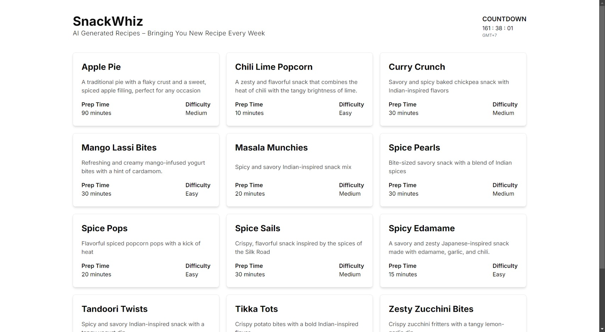

<div align="center">
  <p align="center"></p>
  <h1 style="border: none;">SnackWhiz: AI-Generated Snack Recipes</h1>
  <div>
    
    
    
    
    
  </div>
</div>

## 📋 <a name="table">Table of Contents</a>

1. 🤖 [Introduction](#introduction)
2. ⚙️ [Tech Stack](#tech-stack)
3. 🔋 [Features](#features)
4. 🤸 [Quick Start](#quick-start)

## <a name="introduction">🤖 Introduction</a>

Welcome to SnackWhiz – Your AI-Powered Snack Recipe Generator! This web app automatically generates a new snack recipe every week using Claude AI, scheduled through a Vercel cron job. Each recipe is saved as a Markdown file, enabling a static and efficient web experience without the need for frequent backend calls. SnackWhiz is designed as a learning project to explore the capabilities of static site generation (SSG) and Incremental Static Regeneration (ISR) in Next.js.
<br /><br />


## <a name="tech-stack">⚙️ Tech Stack</a>

- Next.js
- TypeScript
- Shadcn
- TailwindCSS

## <a name="features">🔋 Features</a>

👉 Automated Snack Recipe Generation:

- AI-generated snack recipes created weekly using Claude AI and Github Actions as a cron job.
- Recipes saved as Markdown files, allowing for a static and efficient web experience.
- Vercel cron job integration for automatic recipe updates without manual intervention.

👉 Static Site Generation:

- Utilizes Next.js for static site generation and Incremental Static Regeneration (ISR), providing both speed and up-to-date content.
- No need for continuous backend calls—recipes are pre-rendered and served statically.

## <a name="quick-start">🤸 Quick Start</a>

Follow these steps to set up the project locally on your machine.

**Prerequisites**

Make sure you have the following installed on your machine:

- [Git](https://git-scm.com/)
- [Node.js](https://nodejs.org/en)
- [npm](https://www.npmjs.com/) (Node Package Manager)

**Cloning the Repository**

```bash
git clone https://github.com/Firkhie/snack-whiz.git
cd snack-whiz
```

**Package Installation**

Install the project dependencies using npm:

```bash
npm i
```

**Set Up Environment Variables**

Create a new file named `.env` in the root of your project and add the following content:

```env
ANTHROPIC_API_KEY=
```

Replace the placeholder values with your actual respective account credentials.

**Running the Project**

```bash
npm run dev
```

Open [http://localhost:3000](http://localhost:3000) in your browser to view the project.

#
